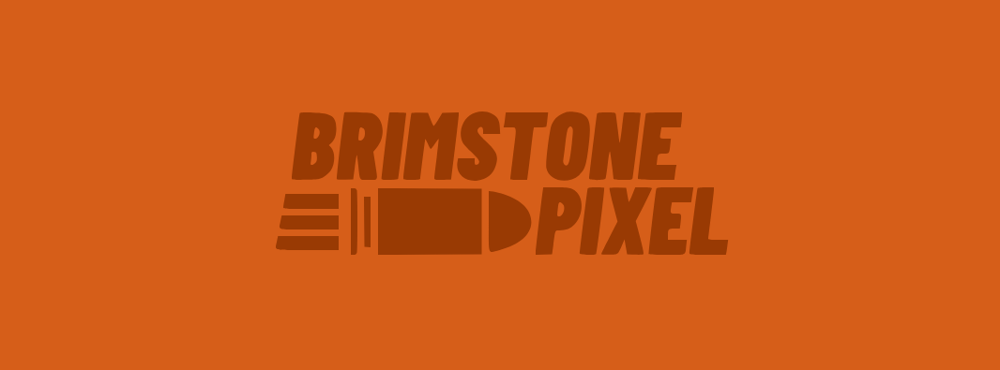
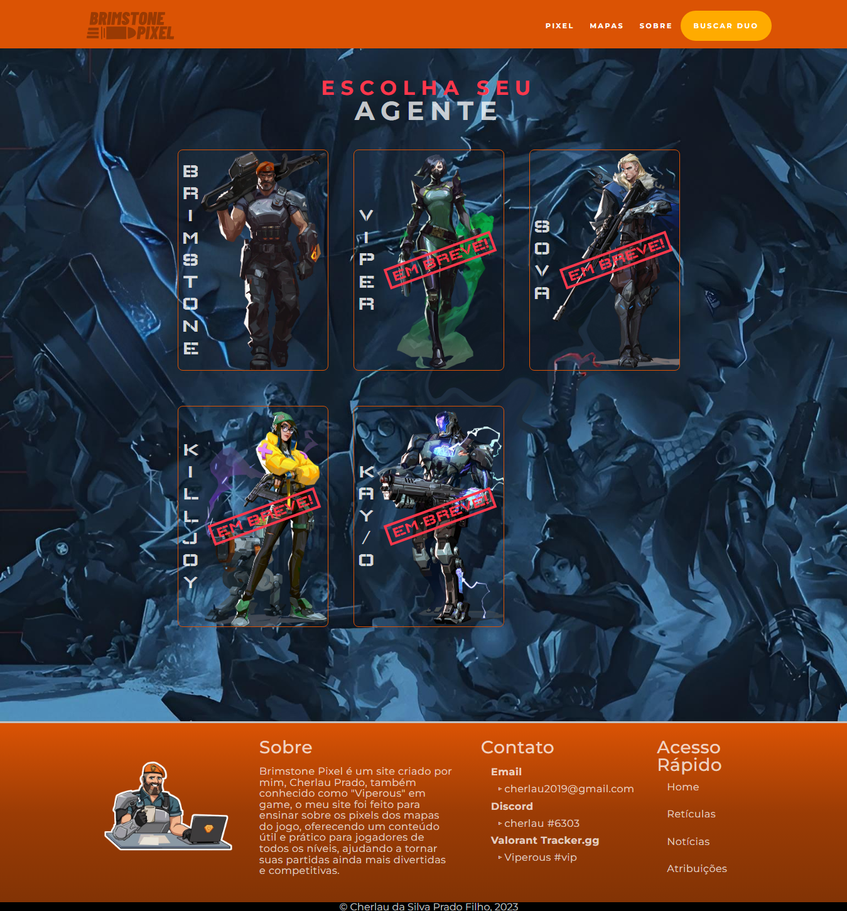
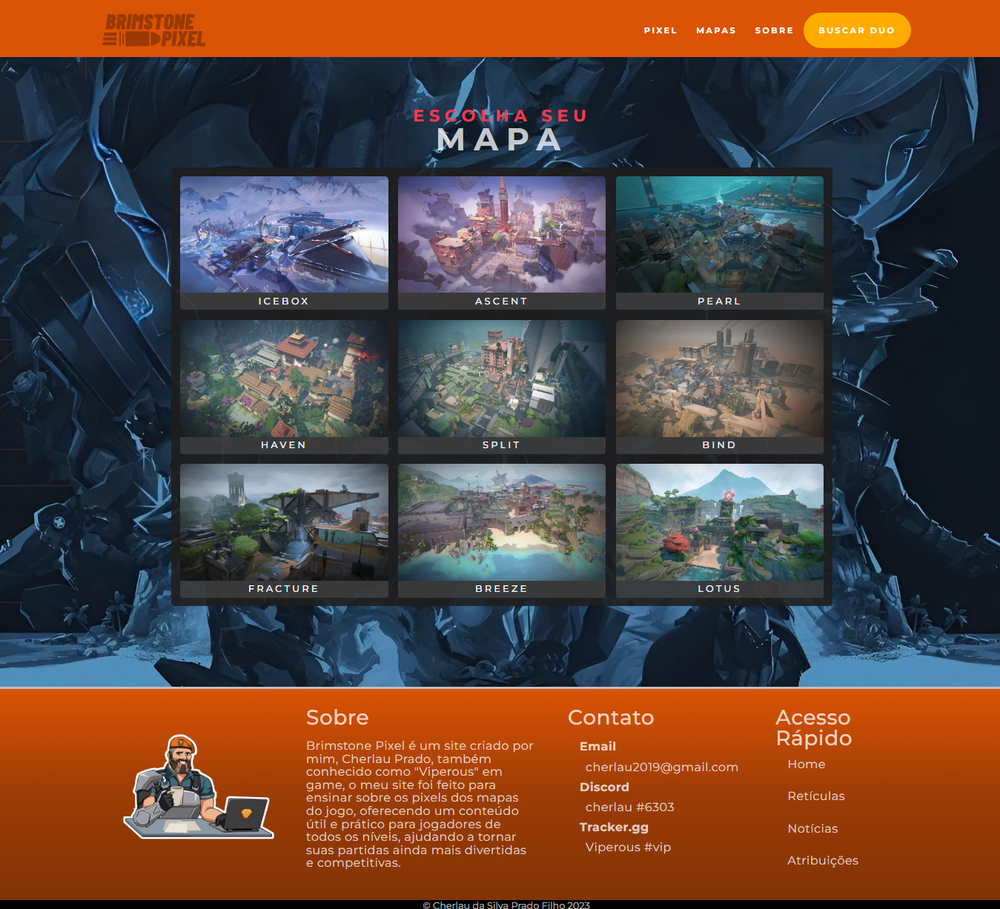
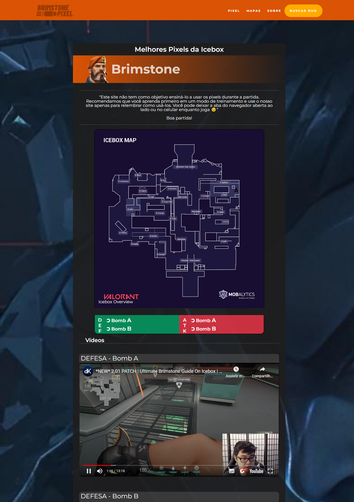
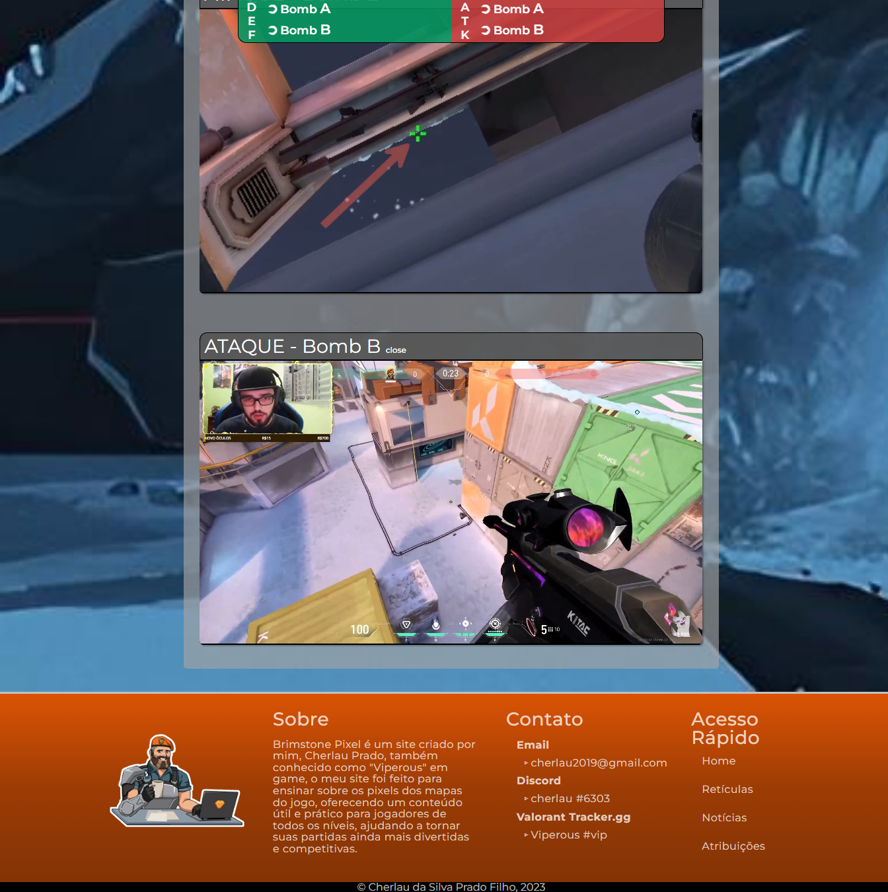
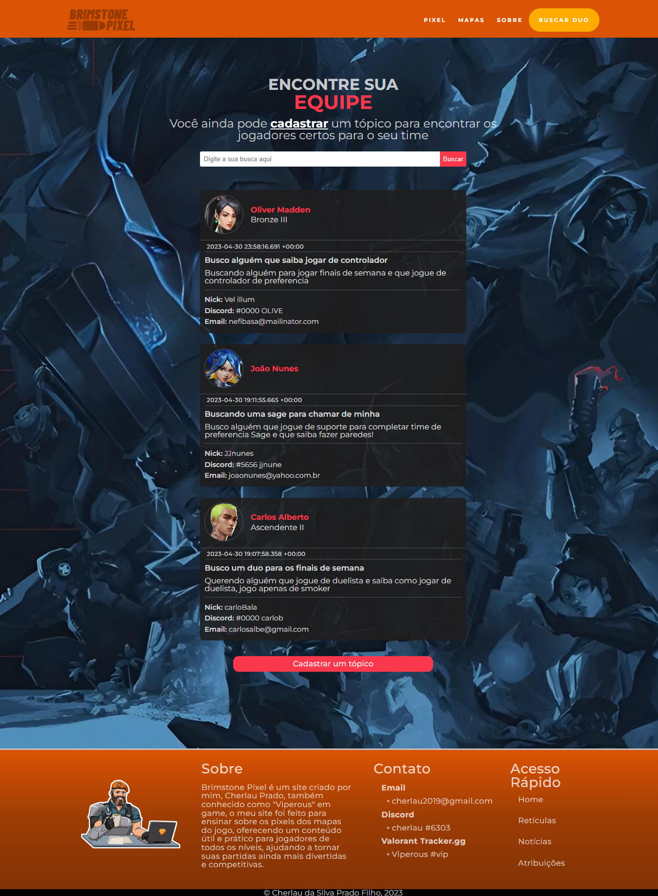
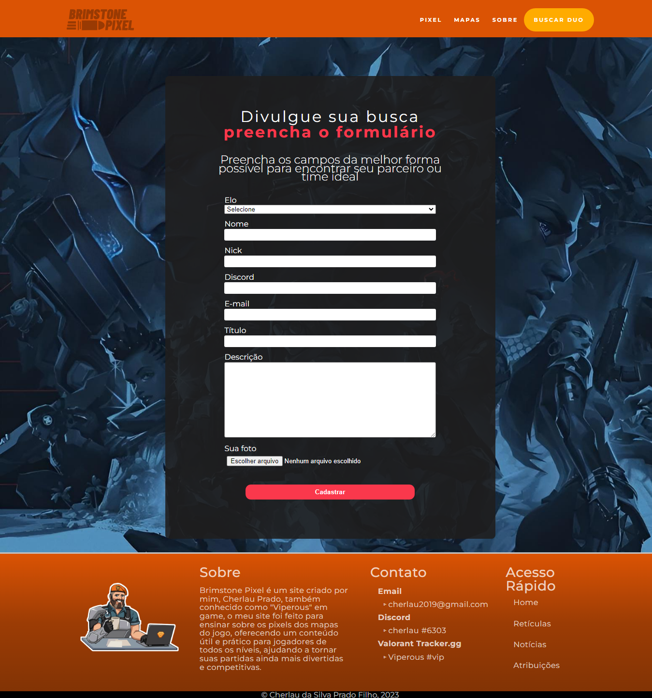

# Brimstone Pixel  - site de pixel do Valorant



<p align="center">
 <a href="#-sobre">Sobre</a> •
 <a href="#-projeto">Projeto</a> •
 <a href="#%EF%B8%8F-autor">Autor</a>
</p>

## 💻 Sobre
 
Brimstone Pixel é um site criado por Cherlau Prado, com o objetivo de fornecer um recurso abrangente e prático sobre os pixels que auxiliam no uso das habilidades dos agentes nos mapas do jogo Valorant. O site não apenas oferece conteúdo útil para os jogadores, mas também proporciona uma plataforma para encontrar outros jogadores e criar conexões para jogarem juntos em partidas competitivas. 

Acesse o site estático (sem o cadastro de novas postagens no banco de dados, para projeto completo veja como instalar <a href="#%F0%9F%91%A8%E2%80%8D%F0%9F%92%BB-Instal">Aqui</a>
https://brimstonepixel.web.app/

## Características

- [x] Site totalmente responsivo
- [x] Página inicial mostra os agentes disponiveis
- [x] Página de mapas para escolher o mapa a cada nova partida
- [x] Página com os vídeos para auxiliar a lembrar os pixels do mapa
- [x] Página do busca duo uma busca para encontrar outros jogadores para jogarem juntos nas partida
- [x] Página para cadastrar uma busca e ser encontrado por outros jogadores

<h3 align="center">
⚙️ Tecnologias utilizadas

<p>&nbsp;</p>


  

</h3>

---

## 🚧 Projeto em construção...

<h3 align="center">Página princiapl - Escolha de agente
  <p></p>
  	
</h3>

<h3 align="center">Escolhendo o Mapa
  <p></p>
  	
</h3>

<h3 align="center">Assistindo os tutoriais dos pixels do mapa
  <p></p>
  	
  	
</h3>

<h3 align="center">Buscando duo
  <p></p>
  	
</h3>

<h3 align="center">Cadastrando uma busca
  <p></p>
  	
</h3>

---

## 👨‍💻 Instal

1. Clone the repository to your local machine

```bash
    git clone git@github.com:cherPrado/brimstone-pixel-projeto-pessoal.git
```

2. Install the dependencies

```bash
    npm install
```

3. Start the application

```bash 
    npm run dev
```

4. Open in browser
```bash 
    http://localhost:3000/
```

---

## ✒️ Autor

| [ <br> <sub> Cherlau Prado </sub>](https://github.com/cherPrado) |
| :--------------------------------------------------------------------------------------------------------------------------------------------: |

<h2 >Entre em contato 🤙🏽</h2>

<div align="center">
<a href="https://www.linkedin.com/in/cherlau-prado/" target="_blank"></a>
<a href="cherlaufilho@discente.ufg.br" target="_blank"></a>
</div>
