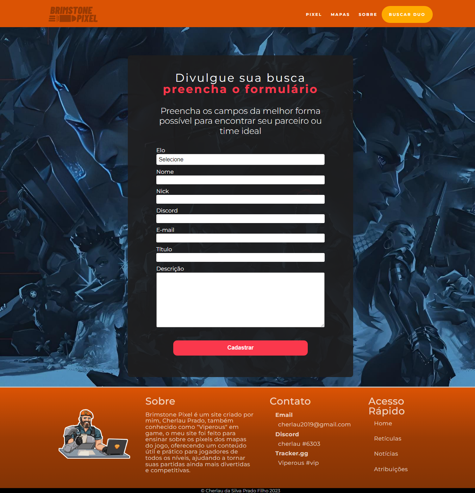

# Brimstone Pixel  - site de pixel do Valorant


<p align="center">
 <a href="#-sobre">Sobre</a> •
 <a href="#-projeto">Projeto</a> •
 <a href="#%EF%B8%8F-autor">Autor</a>
</p>

## 💻 Sobre
 
 Brimstone Pixel é um site que fornecer um guia prático dos agentes e onde lançar suas principais habilidades nos mapas do Valorant. O site não apenas oferece conteúdo útil para os jogadores, mas também proporciona uma plataforma para encontrar outros jogadores e criar conexões para jogarem juntos em partidas competitivas.  

<br>

**Acesse o site estático:<a href="https://brimstonepixel.web.app/" target="_blank"> https://brimstonepixel.web.app</a> (sem o cadastro de novas postagens)**

<br>

**Para conferir o projeto com todas as funcionalidades <a href="#-Instal">faça a instalação</a>**

<br>

<h3 align="center">
⚙️ Tecnologias utilizadas

<p>&nbsp;</p>


  

</h3>

---

<h2 id="-Projeto"> 🚧 Projeto em construção... </h2>

<h3 align="center">Página principal - Escolha de agente
  <p></p>
  	
</h3>

<h3 align="center">Escolhendo o Mapa
  <p></p>
  	
</h3>

<h3 align="center">Assistindo os tutoriais dos pixels do mapa
  <p></p>
  	
  	
</h3>

<h3 align="center">Buscando duo
  <p></p>
  	
</h3>

<h3 align="center">Cadastrando uma busca
  <p></p>
  	
</h3>

---

<h2 id="-Instal"> 👨‍💻 Instalação </h2>

1. Clone o repositório

```bash
    git clone git@github.com:cherPrado/brimstone-pixel-projeto-pessoal.git
```

2. Dentro da pasta abra o terminal e instale as dependências

```bash
    npm install
```

3. Rode a aplicação

```bash 
    npm run dev
```

4. Abra no navegador
```bash 
    http://localhost:3000/
```

---

## ✒️ Autor

| [ <br> <sub> Cherlau Prado </sub>](https://github.com/cherPrado) |
| :--------------------------------------------------------------------------------------------------------------------------------------------: |

<h3 >Entre em contato 🤙🏽</h3>

<div align="center">
<a href="https://www.linkedin.com/in/cherlau-prado/" target="_blank"></a>
<a href="cherlaufilho@discente.ufg.br" target="_blank"></a>
</div>
